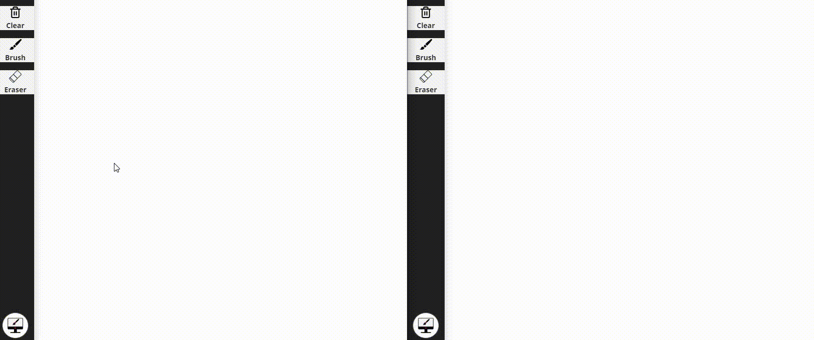

# Real Time Drawing Canvas

  

## [Try it out here]("https://real-time-canvas.glitch.me/")

### Installation

Clone the repository, run `npm install && node ./server.js` on the root directory, and it will be available for you on localhost:5000.

### What I learned/Used on this project

- Websockets
- Express
- Node.js
- P5.js
